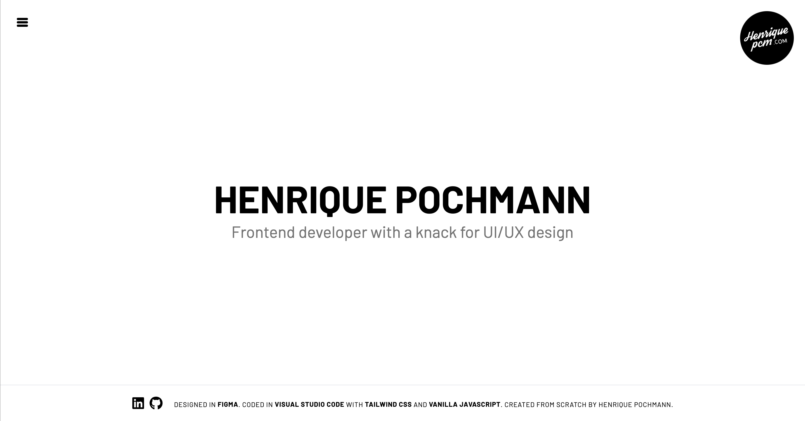

# henriquepcm.com v3 - Built with TypeScript/React and Tailwind CSS

## Description

A paginated, responsive, mobile-first professional website built with TypeScript/React and Tailwind CSS. This project features a clean, uncluttered interface and a slide-in menu that appears upon clicking the burger icon.

## Screenshot



## Installation and Usage

1.   Install Dependencies:
     ```sh
     npm i
     ```
2.   Run Vite:

     ```sh
     npm run dev
     ```

3.   Completion:
     -    You should now be all set to use the project.

## Features

-    **Responsive Design**: Ensures optimal viewing experience across a wide range of devices, from mobile phones to desktop computers.
-    **Mobile-First Approach**: Designed with a focus on mobile usability, ensuring seamless functionality and aesthetics on smaller screens.
-    **React Router Pagination**: Efficiently handles navigation and content loading with React Router, providing a smooth paginated experience.
-    **Font Awesome Icons**: Enhances the visual appeal with a comprehensive set of icons from Font Awesome, adding clarity and style to the interface.
-    **Slide-In Menu**: A user-friendly slide-in menu that appears when the burger menu is clicked, improving navigation and user experience.
-    **Footer Links with Engaging Hover-Over Animations**: Interactive footer links that come alive with engaging animations on hover, adding a touch of sophistication.
-    **Cross-Browser Compatibility**: Compatible with all modern browsers, ensuring consistent behavior across platforms.

## License

This project is licensed under the [MIT License](LICENSE.md).

## Credits

Created by Henrique Pochmann.

## Contact

You can reach out to me via [LinkedIn](https://www.linkedin.com/in/henriquepcm/), [Twitter](https://twitter.com/henriquepcm/), or henriquepcm@gmail.com.

```

```
